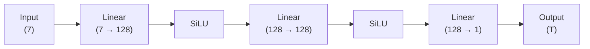

# PINN 版本文档 

[TOC]

本文档用于系统性记录本项目中 **所有 PINN 模型版本及对照模型** 的设计动机、网络结构、训练策略与适用场景。 该文档既作为**开发记录**，也作为后续论文撰写与模型对比实验的技术依据。

---

## 模型版本总览

| 版本编号 | 模型名称     | 类型 | 主要用途                |
| -------- | ------------ | ---- | ----------------------- |
| M01      | FCNN-MVP     | FCNN | 数据管线验证 / 基线性能 |
| M02      | FCNN-ANNEAL  | FCNN | 实现学习率的动态调整    |
| M03      | FCNN-Fourier | FCNN | 特征工程验证            |
| M04      | PINN         | PINN | 多尺度热场建模          |
|          |              |      |                         |
|          |              |      |                         |

#### 输入与输出定义

**输入向量（7 维）** 

| 维度 | 名称        | 单位 | 说明         |
| ---- | ----------- | ---- | ------------ |
| 1    | x           | mm   | 空间坐标     |
| 2    | y           | mm   | 空间坐标     |
| 3    | z           | mm   | 空间坐标     |
| 4    | soc_power   | W    | SoC 功耗     |
| 5    | pmic_power  | W    | PMIC 功耗    |
| 6    | usb_power   | W    | USB 功耗     |
| 7    | other_power | W    | 其他器件功耗 |

**输出变量（1 维）**

| 名称 | 单位 | 说明     |
| ---- | ---- | -------- |
| T    | K    | 稳态温度 |


---

### M01：简单全连接神经网络（FCNN-MVP）

**M01-FCNN-MVP** 是本项目的 **最小可运行基线模型（Minimum Viable Prototype）**，其主要目标并非追求物理一致性或高精度，而是用于：

- 验证 **COMSOL → CSV → PyTorch Dataset → DataLoader → 网络 → Loss** 的完整数据通路；
- 检查 `index.jsonl` 中参数与 CSV 数据的正确对齐；
- 提供后续 PINN 模型的 **性能对照基线**。

该模型 **不包含任何物理约束（PDE residual）**，仅进行纯数据驱动的监督学习。

**项目目录** 

```
comsol_pinn/
├── M01_fcnn_mvp/
│   ├── dataset.py         # 数据加载与参数拼接
│   ├── inference.py       # 推理代码
│   ├── logger.py      	   # 日志模块
│   ├── model.py           # 网络模型
│   ├── train.py           # 训练代码
│   ├── train.sh           # 训练脚本，用于参数传递、并行计算、GPU指定
│   └── logs/       	   # 保存的日志
```

- **模型权重文件**：  `checkpoints/M01_fcnn_mvp.pt` 

#### 网络结构

**全连接前馈神经网络（FCNN）** 



**设计说明** 

- 使用 **SiLU (Swish)** 激活函数，保证一阶导数连续；
- 网络深度与宽度刻意保持较小，以避免掩盖数据或管线问题；
- 不使用 Fourier 特征、不使用残差结构、不使用正则化。

**数据采样策略** 

- 每个训练 step：
  - 随机选择一个 `case_xxxx.csv`；
  - 从该 case 中随机采样固定数量的空间点；
  - 拼接对应的功耗参数作为条件输入。

- 该策略确保：

  - 不需要一次性加载 52 万点；
  - 每个 batch 对应一个明确的物理工况；
  - 与后续 PINN 的采样逻辑保持一致。

#### 总结

**M01-FCNN-MVP** 是整个 PINN 项目的“地基版本”。  

- ❌ 不满足热传导物理约束；
- ❌ 对高梯度区域（热源附近）拟合能力有限；
- ❌ 无法外推到未见过的参数组合；
- ❌ 不适合用于最终工程预测。

它的价值不在于预测精度，而在于：

> **确保数据、参数、训练流程在进入复杂 PINN 架构之前是完全正确的。**

在此基础上，后续所有 PINN 版本都可以被清晰、可控地构建与对比。


---

### M02：自适应学习率全连接神经网络（FCNN-ANNEAL）

**M02-FCNN-ANNEAL** 是在 M01 基线模型之上引入 **学习率动态调整机制** 的改进版本，其核心目标是：

- 解决 M01 中 **固定学习率导致的收敛缓慢与残余误差偏大问题**；
- 在不引入任何物理约束的前提下，验证 **优化策略本身对收敛行为的影响**；
- 为后续更复杂 PINN（Fourier / PDE / 多尺度）提供一个 **更稳定、更高效的训练基线**。

该模型仍然属于 **纯数据驱动 FCNN**，不包含 PDE residual，仅在 **训练策略层面** 进行增强。

#### 关键改进点：学习率自适应退火（Annealing）

M02 引入 **`ReduceLROnPlateau` 学习率调度器**，根据训练过程中 **loss 的收敛情况自动调整学习率**：

- 当连续若干 epoch 内 loss 无明显下降时，自动降低学习率；
- 避免在初期使用过小学习率导致收敛缓慢；
- 避免在后期使用过大学习率导致震荡或无法精细拟合。

**调度策略配置**：

- 调度器：`ReduceLROnPlateau`
- 监控指标：训练集 MSE Loss
- 衰减因子：`factor = 0.5`
- 容忍轮数：`patience = 10`
- 最小学习率：`min_lr = 1e-5`

该策略在 **无需额外超参数搜索** 的情况下，显著提升了训练稳定性。

#### 网络结构与数据策略

- 网络结构：**与 M01 完全一致**
- 输入 / 输出定义：**与 M01 完全一致**
- 数据采样策略：**与 M01 完全一致**
- batch 维度：支持 **多 case 并行训练**（显存允许情况下）

因此，M02 与 M01 的性能差异 **可以完全归因于优化策略本身**，具备良好的对照实验意义。


---

### M03：Fourier 特征全连接神经网络（FCNN-Fourier，失败案例）

**M03-FCNN-Fourier** 尝试在 M02 的基础上引入 **Fourier 特征编码（Fourier Feature Mapping）**，以提升模型对 **热源附近高频温度梯度** 的表达能力。该版本的初衷是验证：

> 在不引入物理约束（PDE residual）的前提下，仅通过特征空间扩展，是否能够显著改善 FCNN 对复杂温度场的拟合能力。

然而，实验结果表明，该尝试 **未能带来性能提升，反而在多个指标上出现退化**，因此被明确记录为 **失败的特征工程案例**。

> We observe that naive Fourier feature encoding degrades performance in purely data-driven FCNN models for parametric thermal fields, indicating that high-frequency encoding without physical constraints may hinder optimization.

#### 设计动机

- 热源附近温度梯度陡峭，存在明显的局部高频特征；
- Fourier 特征在计算机视觉、隐式表示（NeRF）等任务中已被证明可显著提升高频表达能力；
- 假设通过将输入映射至高维频域空间，可增强 FCNN 对复杂热场的拟合能力。

#### 实现方式（简述）

- 对 **7 维输入向量整体** 进行 Fourier 特征编码；
- 编码后特征作为 FCNN 的直接输入；
- 网络结构、优化策略与 M02 保持一致，以确保对照公平性。

#### 实验现象与问题分析

实验中观察到以下现象：

- ❌ 训练收敛速度明显下降；
- ❌ 最终残余误差高于 M02；
- ❌ 热源附近预测结果出现非物理振荡；
- ❌ 对功率参数变化的泛化能力下降。

综合分析认为，性能退化并非实现错误，而是源于 **特征构建方式与问题结构的不匹配**，主要原因包括：

1. **物理语义破坏**  
   Fourier 特征对所有输入维度一视同仁，导致功率参数（全局条件变量）被错误地映射为高频振荡特征。

2. **优化难度显著增加**  
   高维振荡特征使 loss landscape 更加崎岖，在缺乏物理约束的情况下，优化器难以稳定收敛。

3. **问题本质不满足 Fourier 假设**  
   热传导稳态解在大部分空间区域是平滑的，仅在局部存在高梯度，并不具备全局周期性或强振荡特征。

#### 结论与定位

**M03-FCNN-Fourier 被明确判定为失败版本，其结论具有明确的工程与研究价值：**

> *Naive Fourier feature encoding degrades performance in purely data-driven FCNN models for parametric thermal fields, indicating that high-frequency encoding without physical constraints may hinder optimization.*

该结论为后续模型设计提供了重要指导：

- Fourier 特征 **不适合作为纯 FCNN 的直接输入增强手段**；
- 高频特征表达应与 **物理约束（PDE residual）或结构性先验** 结合使用；
- 特征工程需要尊重 **空间变量与条件参数的物理角色差异**。

#### 后续改进方向

基于 M03 的失败经验，后续特征工程改进将以 **M03b** 作为新的起点，重点探索：

- 空间坐标与功率参数的 **解耦编码（Conditional Encoding）**；
- 仅对空间坐标引入多尺度或频域特征；
- 与 PINN 物理约束协同设计的特征表达方式。

M03 作为失败案例将被完整保留，用于对照分析与论文中方法有效性讨论。


---

### M04a：物理约束 PINN（Laplace-PINN）

**M04a-PINN** 是本项目中首次引入物理约束项的版本，其目标是：

> 在不依赖显式热源项或边界条件的前提下，通过物理约束提升模型的物理一致性与空间外推能力。

该版本在 M02 的 FCNN 基础上，增加了稳态热传导方程的残差项作为物理损失：
$$
∇^2T=0
$$

#### 设计动机

- M01–M03 均为纯数据驱动模型，缺乏物理一致性；
- 热传导稳态场在无源区域应满足 Laplace 方程；
- 通过引入 PDE residual，可抑制非物理振荡、提升空间外推稳定性；
- 不依赖显式热源项 q(x)，通过温度阈值自动识别“近似无源区域”。

#### 网络结构与训练策略

- 网络结构：与 M02 完全一致（7→128→128→1，SiLU 激活）；
- 输入维度：空间坐标 + 功率参数（7维）；
- 输出维度：温度标量 T；
- 坐标归一化：每个 case 均归一化至 [−1,1]，确保导数尺度一致；
- PDE loss 区域：仅在低温区域施加 Laplace 约束（自动生成 mask）；
- 总损失函数：

$$
L=L_{data}+λ_{pde}⋅L_{pde}
$$

#### 实验现象与问题分析

- ✅ 加入 PDE loss 后，模型在前期收敛显著加快；
- ✅ 训练初期 loss 降速快于 M02，拟合更平滑；
- ❌ 训练后期，误差下降趋于停滞，最终精度劣于纯数据驱动模型；
- ❌ 在热源附近，预测结果出现“过度平滑”现象，无法拟合真实高梯度结构。

#### 原因分析

1. **物理项覆盖区域过广**   当前使用固定温度阈值（如 0.7×T_max）生成 mask，可能误将热源边缘区域纳入 PDE loss 范围，导致真实高梯度区域被“强行平滑”。
2. **物理项权重固定，未做动态调节**   固定的 $λ_{pde}$ 在训练后期可能压制数据项的精细拟合能力，导致 loss 陷入平衡状态。
3. **网络表达能力不足**   当前 FCNN 结构较浅，无法同时满足数据拟合与 Laplace 平滑的双重约束，容易出现“折中解”。

#### 后续改进方向

为解决上述问题，后续将探索以下改进：

- ✅ **物理项权重退火（Annealing）**
  - 训练初期使用较大 $λ_{pde}$，强化物理一致性；
  - 随 epoch 逐步降低权重，释放数据项拟合能力；
  - 形式如：

$$
λ_{pde}(t)=λ_0⋅\exp⁡(−γt)
$$

- ✅ **软掩码 PDE 区域（Soft Mask）**
  - 将当前硬阈值 mask 替换为 sigmoid 权重：

$$
w(x)=σ(α⋅(T_{thresh}−T(x)))
$$

- 在热源边缘区域实现平滑过渡，避免误罚高梯度区域。

#### 总结

M04a-PINN 是从“纯数据拟合”迈向“物理一致性建模”的关键版本。 尽管当前版本在后期精度上仍存在不足，但其结构清晰、可控性强，为后续物理建模与多尺度结构奠定了坚实基础。

> M04a 的价值不在于最终误差最小，而在于： **为物理约束的引入提供了最小可运行、最清晰可解释的工程基线。**


---

### M04b、c：PDE 权重退火与软掩码增强的 PINN（Anneal + SoftMask）

**M04b、c-PINN** 是对 M04（弱物理约束 Laplace-PINN）的直接工程化改进版本，目标是解决 M04 的两个核心问题：

- **后期误差下降停滞**：固定 $ \lambda_{pde} $ 造成物理项长期压制数据项的精细拟合；
- **热源边缘过度平滑**：硬阈值 mask 将真实高梯度区域误纳入 PDE 约束区域。

M04b 在不改变主干网络的前提下，通过 **训练策略与损失构造** 的增强，提高 PINN 在“物理一致性 vs 数据拟合精度”之间的可控性。

#### 关键改进点总览

| 改进点                     | M04             | M04b                              |
| -------------------------- | --------------- | --------------------------------- |
| PDE 权重 $ \lambda_{pde} $ | 固定常数        | 支持指数退火（anneal）+ 下限截断  |
| PDE 区域 mask              | 硬阈值（0/1）   | 支持 Soft Mask（sigmoid）平滑过渡 |
| 采样点数                   | 固定配置        | 显存感知默认值 + OOM 自适应降采样 |
| 优化器与调度               | （与 M02 类似） | AdamW + ReduceLROnPlateau         |
| 训练鲁棒性                 | 手动调参为主    | 自动化、可恢复训练更强            |

**网络结构与输入输出**

- 网络结构：**与 M04 完全一致**（延续最小可控基线）
- 输入：7 维（xyz + 4 个功耗参数）
- 输出：温度标量 $T$（训练时为归一化后的 $T_{norm}$）

> M04b 的定位是“在保持对照公平性前提下，证明训练策略与物理项构造的有效性”，因此不在该版本引入 Fourier / SIREN / 残差结构等结构性变化。

**数据采样与归一化（Dataset 侧）**

M04b 使用分层采样（uniform + hot-biased）以覆盖“全域平滑区”和“局部高梯度热区”。

- **分层采样**：
  - **uniform 采样**：覆盖整体几何域
  - **hot-biased 采样**：按温度权重（$T_{norm}^{temp\_power}$）偏向高温区域
  - `hot_ratio=0.4`，`temp_power=3.0`

- **坐标归一化（每 case）**：将采样到的 xyz 映射到 $[-1, 1]$
  - 目的：保证自动微分的导数尺度一致，提升 Laplacian 数值稳定性

- **功率参数归一化**：假设功率范围 0W–3W，将参数线性映射到 $[-1,1]$

- **温度归一化**：每 case 的 $T$ min-max 映射到 $[-1,1]$

> 注意：当前实现是 **per-case 归一化**，意味着不同 case 的绝对温度标尺被“折叠”为相对标尺；这对跨 case 对比与物理解释有利有弊，需在后续版本中明确“训练标尺 vs 推理反归一化”策略。

**物理项权重退火（PDE annealing）**

M04 的问题之一是：固定 $ \lambda_{pde} $ 在训练后期仍然持续施加强约束，使模型难以追求更低的数据误差。

M04b 支持指数退火：

$$
\lambda_{pde}(t) = \max(\lambda_{min}, \lambda_0 \cdot \exp(-\gamma (t-1)))
$$
对应实现：

- `--use_pde_anneal`
- `--pde_anneal_gamma`（默认 0.5）
- `--pde_lambda_min`（默认 0.0）
- `--lambda_pde`（默认 1.0）

**设计意图**：

- **前期**：较大 $ \lambda_{pde} $ 抑制非物理振荡、加速收敛到“平滑可行域”
- **后期**：逐步减弱 PDE 项，让数据项主导精细拟合（尤其是热源附近复杂结构）

**PDE 区域 mask：硬阈值 vs Soft Mask**

M04 使用硬阈值：

$$
w(x)=\mathbb{1}[T(x) < \tau]
$$
M04b 在此基础上引入可选 Soft Mask：

$$
w(x)=\sigma(\alpha(\tau - T(x)))
$$
其中：

- $\tau = r \cdot T_{max}$
- `--mask_temp_ratio`（默认 0.7）
- `--mask_alpha`（默认 40）
- `--use_soft_mask`：开启则使用 sigmoid，否则退化为硬 mask

对应实现逻辑：

- 先取本 batch 的 $T_{norm}$ 的最大值作为 $T_{max}$
- 阈值 `thresh = mask_temp_ratio * T_max`
- 用 sigmoid 平滑生成权重

**设计意图**：

- 在热源边缘实现“物理约束强度的连续退场”
- 降低误罚真实高梯度区域的概率
- 改善“过度平滑”问题，同时保留对远场无源区域的 Laplace 约束

**总损失函数**：
$$
\mathcal{L}
= \mathcal{L}_{data}\lambda_{pde}(t) \cdot \mathcal{L}_{pde}
$$

其中数据项（监督）：

$$
\mathcal{L}_{data} = \text{MSE}(T_{pred}, T_{norm})
$$
物理项（带权 Laplacian）：
$$
\mathcal{L}_{pde} = \mathbb{E}\left[(\nabla^2 T)^2 \cdot w(x)\right]
$$

**显存感知与 OOM 自恢复训练**

M04b 将“可训练性”放在首位，在训练脚本中引入两层显存策略：

1. **启动时显存感知 points_per_case 默认值**
   - 使用 `torch.cuda.mem_get_info()` 获取空闲显存
   - 按显存区间选择默认 `points_per_case`（8k → 320k）

2. **运行时 OOM 捕获与降采样重试**
   - 捕获 `torch.cuda.OutOfMemoryError`
   - `points_per_case = max(10000, points_per_case // 2)`
   - 重建 Dataset 与 DataLoader
   - 当前 epoch 退出本轮（`break`）

该策略使训练对不同 GPU/共享环境的鲁棒性显著提升，减少“因一次 OOM 直接终止实验”的工程成本。

**优化器与学习率调度**

- 优化器：`AdamW(lr=5e-3)`
- 调度器：`ReduceLROnPlateau`
  - `factor=0.5`
  - `patience=6`
  - `min_lr=1e-5`
- 每 epoch 使用 `avg_loss` 作为 plateau 判据

**设计意图**：

- 训练早期允许更激进的步长（配合 PDE 约束稳定训练）
- 后期自动减小学习率，改善精细拟合能力并减少震荡

#### 适用场景与局限性

##### 适用场景

- 希望在 **不引入显式热源项/边界条件建模** 的前提下，提高物理一致性
- 训练中出现：
  - 热源边缘预测过度平滑
  - PDE loss 过强导致后期不降
  - GPU 共享环境频繁 OOM

##### 局限性与风险点

- **per-case 归一化会改变跨 case 的绝对标尺**：推理与评估必须严格执行反归一化，否则指标不可比
- Soft mask 的阈值来自 $T_{max}$（batch 内统计）：当 batch/采样偏置改变时，mask 的“物理区域定义”也会漂移
- PDE loss 当前仍是弱形式（未显式建模 $Q$），对热源区的物理一致性保证有限

#### 与后续版本的关系

M04b 解决的是 M04 的“训练策略与物理区域控制”问题，为后续版本提供更稳健的基座：

- **M04c**：将 soft mask 进一步系统化（例如使用基于几何/器件区域的 mask，而非温度阈值）


---

### M04d：长周期友好的 PINN（Cosine / Plateau / Hybrid Annealing）

**M04d-PINN** 是在 M04b/c 的基础上，针对 **长周期 PINN 训练中学习率调度不稳定、后期收敛乏力** 问题所做的系统性改进版本。 该版本的核心目标是：

> **使 PINN 在长时间训练中保持稳定、可预测的优化节奏，并与 PDE 权重退火形成时间尺度上的一致性。**

M04d 不引入新的网络结构或物理方程，而是聚焦于 **学习率调度机制的工程化升级**，使其更适配 PINN 的训练特性。

#### 设计动机：为什么需要新的学习率调度？

在 M04b/c 中，学习率调度仍沿用 `ReduceLROnPlateau`，该策略在 PINN 场景下暴露出以下局限：

1. **对 loss 噪声高度敏感**
   - PINN 的总 loss 由数据项 + PDE 项构成；
   - PDE residual 在训练中波动较大，容易触发“误判 plateau”。
2. **学习率下降时机不可控**
   - plateau 触发依赖历史窗口；
   - 在长周期训练中，学习率可能过早衰减，导致后期“冻结”。
3. **与 PDE 权重退火时间尺度不匹配**
   - $ \lambda_{pde}(t) $ 是显式时间函数；
   - 学习率却是隐式、事件驱动，二者节奏不一致。

这些问题在 **epoch ≥ 100 的长周期训练** 中尤为明显。

#### 核心改进一：引入 Cosine Annealing 学习率调度

M04d 在保留原有调度器的同时，引入 **Cosine Annealing** 作为可选策略，并通过 `args` 显式控制。

**新增学习率调度选项**：

- `ReduceLROnPlateau`（保留，作为对照）
- `CosineAnnealingLR`（新增，推荐）

通过参数选择：

```bash
--lr_scheduler plateau   # M04b/c 行为
--lr_scheduler cosine    # M04d 新行为
```

当启用 `cosine` 调度时，学习率按 epoch 显式变化：
$$
η(t)=η_{min}+\frac{1}{2}(η_0−η_{min})(1+\cos⁡(\frac{t}{T_{max}}\pi))
$$
其中：

- $ \eta_0 $：初始学习率
- $ \eta_{min} $：最小学习率
- $ T_{max} $：退火周期（通常设为总 epoch 数）

**对应参数**

| 参数名             | 默认值 | 说明            |
| ------------------ | ------ | --------------- |
| `--lr_scheduler`   | cosine | 学习率调度类型  |
| `--cosine_tmax`    | epochs | Cosine 周期长度 |
| `--cosine_eta_min` | 1e-5   | 最小学习率      |

#### 核心改进二：Hybrid Annealing（Cosine + Plateau 兜底）

M04d 的关键新增能力是 **Hybrid 学习率调度策略**：

```bash
--lr_scheduler hybrid
```

**Hybrid 策略同时启用**：

- `CosineAnnealingLR`：作为主调度器（时间驱动）
- `ReduceLROnPlateau`：作为兜底调度器（事件驱动）

**调度逻辑** 

- 每个 epoch：
  - **始终执行 Cosine step**，保证整体退火节奏平滑；
  - **同时监控 loss**，当出现真实 plateau 时，由 Plateau 强制降低学习率。

#### 设计意图

> **Cosine 决定“物理时间节奏”，Plateau 负责“异常兜底”。**

这种组合在 PINN 场景下具有显著优势：

| 维度               | Cosine | Plateau | Hybrid |
| ------------------ | ------ | ------- | ------ |
| 长周期稳定性       | ✓      | ✗       | **✓**  |
| 对噪声鲁棒         | ✗      | ✓       | **✓**  |
| 后期精修能力       | △      | ✓       | **✓**  |
| 与 PDE anneal 协同 | ✓      | ✗       | **✓**  |

#### 与 PDE 权重退火的协同关系

M04d 的整体训练策略体现为 **双退火（Dual Annealing）**：

- **学习率退火**：Cosine / Hybrid
- **物理权重退火**：$ \lambda_{pde}(t) $

训练过程呈现清晰阶段性：

- **前期**
  - 学习率较大
  - $ \lambda_{pde} $ 较大
  - 快速进入物理可行解空间
- **中后期**
  - 学习率平滑下降
  - $ \lambda_{pde} $ 同步指数衰减
  - 数据项逐步主导精细拟合

该机制显著缓解了：

- 后期 loss 停滞
- PDE 项长期压制数据项
- 学习率骤降导致的欠拟合

#### 适用场景

M04d 特别适合以下情况：

- 训练 epoch ≥ 100 的 PINN 任务
- PDE residual 噪声较大
- 使用 PDE 权重退火（anneal）
- 希望获得 **可预测、平滑的收敛行为**

其核心贡献在于：

> **将 PINN 的优化过程从“事件驱动”升级为“时间主导 + 事件兜底”的混合调度体系。**

M04d 将作为后续版本的 **默认训练基座**。


