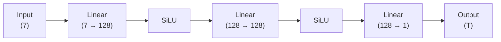

# PINN 版本文档

[TOC]

本文档用于系统性记录本项目中 **所有 PINN 模型版本及对照模型** 的设计动机、网络结构、训练策略与适用场景。 该文档既作为**开发记录**，也作为后续论文撰写与模型对比实验的技术依据。

---

## 模型版本总览

| 版本编号 | 模型名称     | 类型 | 主要用途                |
| -------- | ------------ | ---- | ----------------------- |
| M01      | FCNN-MVP     | FCNN | 数据管线验证 / 基线性能 |
| M02      | FCNN-ANNEAL  | FCNN | 实现学习率的动态调整    |
| M03      | FCNN-Fourier | FCNN | 特征工程验证            |
| M04      | PINN-Fourier | PINN | 多尺度热场建模          |
| M05      | PINN-SIREN   | PINN | 高阶导数稳定性          |
| M06      | PINN-Domain  | PINN | 热源区域分解建模        |

#### 输入与输出定义

**输入向量（7 维）** 

| 维度 | 名称        | 单位 | 说明         |
| ---- | ----------- | ---- | ------------ |
| 1    | x           | mm   | 空间坐标     |
| 2    | y           | mm   | 空间坐标     |
| 3    | z           | mm   | 空间坐标     |
| 4    | soc_power   | W    | SoC 功耗     |
| 5    | pmic_power  | W    | PMIC 功耗    |
| 6    | usb_power   | W    | USB 功耗     |
| 7    | other_power | W    | 其他器件功耗 |

**输出变量（1 维）**

| 名称 | 单位 | 说明     |
| ---- | ---- | -------- |
| T    | K    | 稳态温度 |


---

### M01：简单全连接神经网络（FCNN-MVP）

**M01-FCNN-MVP** 是本项目的 **最小可运行基线模型（Minimum Viable Prototype）**，其主要目标并非追求物理一致性或高精度，而是用于：

- 验证 **COMSOL → CSV → PyTorch Dataset → DataLoader → 网络 → Loss** 的完整数据通路；
- 检查 `index.jsonl` 中参数与 CSV 数据的正确对齐；
- 提供后续 PINN 模型的 **性能对照基线**。

该模型 **不包含任何物理约束（PDE residual）**，仅进行纯数据驱动的监督学习。

---

**项目目录** 

```
comsol_pinn/
├── M01_fcnn_mvp/
│   ├── train.sh           # 训练脚本，用于向main()函数传递参数、GPU指定
│   ├── train.py           # 训练代码
│   ├── inference.py       # 推理代码
│   ├── model.py           # 简单全连接网络
│   ├── dataset.py         # 数据加载与参数拼接
│   ├── logger.py      	   # 日志模块
│   └── logs/       	   # 保存的日志
```

- **模型权重文件**：  `checkpoints/M01_fcnn_mvp.pt` 

---

#### 网络结构

**全连接前馈神经网络（FCNN）** 



**设计说明** 

- 使用 **SiLU (Swish)** 激活函数，保证一阶导数连续；
- 网络深度与宽度刻意保持较小，以避免掩盖数据或管线问题；
- 不使用 Fourier 特征、不使用残差结构、不使用正则化。

**数据采样策略** 

- 每个训练 step：
  - 随机选择一个 `case_xxxx.csv`；
  - 从该 case 中随机采样固定数量的空间点；
  - 拼接对应的功耗参数作为条件输入。

- 该策略确保：

  - 不需要一次性加载 52 万点；
  - 每个 batch 对应一个明确的物理工况；
  - 与后续 PINN 的采样逻辑保持一致。

---

#### 总结

**M01-FCNN-MVP** 是整个 PINN 项目的“地基版本”。  

- ❌ 不满足热传导物理约束；
- ❌ 对高梯度区域（热源附近）拟合能力有限；
- ❌ 无法外推到未见过的参数组合；
- ❌ 不适合用于最终工程预测。

它的价值不在于预测精度，而在于：

> **确保数据、参数、训练流程在进入复杂 PINN 架构之前是完全正确的。**

在此基础上，后续所有 PINN 版本都可以被清晰、可控地构建与对比。


---

### M02：自适应学习率全连接神经网络（FCNN-ANNEAL）

**M02-FCNN-ANNEAL** 是在 M01 基线模型之上引入 **学习率动态调整机制** 的改进版本，其核心目标是：

- 解决 M01 中 **固定学习率导致的收敛缓慢与残余误差偏大问题**；
- 在不引入任何物理约束的前提下，验证 **优化策略本身对收敛行为的影响**；
- 为后续更复杂 PINN（Fourier / PDE / 多尺度）提供一个 **更稳定、更高效的训练基线**。

该模型仍然属于 **纯数据驱动 FCNN**，不包含 PDE residual，仅在 **训练策略层面** 进行增强。

---

#### 关键改进点：学习率自适应退火（Annealing）

M02 引入 **`ReduceLROnPlateau` 学习率调度器**，根据训练过程中 **loss 的收敛情况自动调整学习率**：

- 当连续若干 epoch 内 loss 无明显下降时，自动降低学习率；
- 避免在初期使用过小学习率导致收敛缓慢；
- 避免在后期使用过大学习率导致震荡或无法精细拟合。

**调度策略配置**：

- 调度器：`ReduceLROnPlateau`
- 监控指标：训练集 MSE Loss
- 衰减因子：`factor = 0.5`
- 容忍轮数：`patience = 10`
- 最小学习率：`min_lr = 1e-5`

该策略在 **无需额外超参数搜索** 的情况下，显著提升了训练稳定性。

---

#### 网络结构与数据策略

- 网络结构：**与 M01 完全一致**
- 输入 / 输出定义：**与 M01 完全一致**
- 数据采样策略：**与 M01 完全一致**
- batch 维度：支持 **多 case 并行训练**（显存允许情况下）

因此，M02 与 M01 的性能差异 **可以完全归因于优化策略本身**，具备良好的对照实验意义。


---

### M03：Fourier 特征全连接神经网络（FCNN-Fourier，失败案例）

**M03-FCNN-Fourier** 尝试在 M02 的基础上引入 **Fourier 特征编码（Fourier Feature Mapping）**，以提升模型对 **热源附近高频温度梯度** 的表达能力。该版本的初衷是验证：

> 在不引入物理约束（PDE residual）的前提下，仅通过特征空间扩展，是否能够显著改善 FCNN 对复杂温度场的拟合能力。

然而，实验结果表明，该尝试 **未能带来性能提升，反而在多个指标上出现退化**，因此被明确记录为 **失败的特征工程案例**。

> We observe that naive Fourier feature encoding degrades performance in purely data-driven FCNN models for parametric thermal fields, indicating that high-frequency encoding without physical constraints may hinder optimization.

---

#### 设计动机

- 热源附近温度梯度陡峭，存在明显的局部高频特征；
- Fourier 特征在计算机视觉、隐式表示（NeRF）等任务中已被证明可显著提升高频表达能力；
- 假设通过将输入映射至高维频域空间，可增强 FCNN 对复杂热场的拟合能力。

---

#### 实现方式（简述）

- 对 **7 维输入向量整体** 进行 Fourier 特征编码；
- 编码后特征作为 FCNN 的直接输入；
- 网络结构、优化策略与 M02 保持一致，以确保对照公平性。

---

#### 实验现象与问题分析

实验中观察到以下现象：

- ❌ 训练收敛速度明显下降；
- ❌ 最终残余误差高于 M02；
- ❌ 热源附近预测结果出现非物理振荡；
- ❌ 对功率参数变化的泛化能力下降。

综合分析认为，性能退化并非实现错误，而是源于 **特征构建方式与问题结构的不匹配**，主要原因包括：

1. **物理语义破坏**  
   Fourier 特征对所有输入维度一视同仁，导致功率参数（全局条件变量）被错误地映射为高频振荡特征。

2. **优化难度显著增加**  
   高维振荡特征使 loss landscape 更加崎岖，在缺乏物理约束的情况下，优化器难以稳定收敛。

3. **问题本质不满足 Fourier 假设**  
   热传导稳态解在大部分空间区域是平滑的，仅在局部存在高梯度，并不具备全局周期性或强振荡特征。

---

#### 结论与定位

**M03-FCNN-Fourier 被明确判定为失败版本，其结论具有明确的工程与研究价值：**

> *Naive Fourier feature encoding degrades performance in purely data-driven FCNN models for parametric thermal fields, indicating that high-frequency encoding without physical constraints may hinder optimization.*

该结论为后续模型设计提供了重要指导：

- Fourier 特征 **不适合作为纯 FCNN 的直接输入增强手段**；
- 高频特征表达应与 **物理约束（PDE residual）或结构性先验** 结合使用；
- 特征工程需要尊重 **空间变量与条件参数的物理角色差异**。

---

#### 后续改进方向

基于 M03 的失败经验，后续特征工程改进将以 **M03b** 作为新的起点，重点探索：

- 空间坐标与功率参数的 **解耦编码（Conditional Encoding）**；
- 仅对空间坐标引入多尺度或频域特征；
- 与 PINN 物理约束协同设计的特征表达方式。

M03 作为失败案例将被完整保留，用于对照分析与论文中方法有效性讨论。

---


